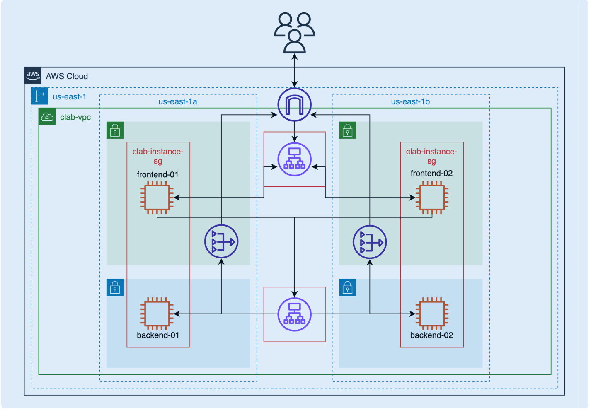

VPC Networking Overview Diagram

<!-- create vpc -->

1. vpc requirement
    - 2 AZs
    - public and private for each AZs
    - add NAT for each private subnets

<!-- setup application in single AZ -->

2. security group requirement for ec2-instance
    - naming "clab-instance-sg"
    - allow inbound ssh 22
    - allow inbound TCP/3000

3. lunch 1 backend app
    - select in clab vpc
    - select in private subnet
    - select clab-instance-sg
    - select no KeyPair
    - add User-data script from '/backend-server/ec2.user-data.sh'

4. lunch 1 frontend app
    - select in clab vpc
    - select in public subnet
    - select clab-instance-sg
    - select no KeyPair

5. connect to frontend app and update backend-IP
    - use bash script from './frontend-app/setup.sh'
    - npm start

6. start app and access by ec2-frontend public IP

<!-- lunch second AZ from instance template -->

7. create lunch template from both instance
    - following current setting except, VPC, subnet.
    - for frontend instance checking public IP enable

8. lunch both instance into second AZs

<!-- add internal ALB into application -->

9. create internal target group
    - select instance type
    - select backend instances and set port to 3000

10. create sg for internal target group
    - naming "clab-balancer-sg"
    - allow TCP/3000

11. create internal-ALB
    - select internal target group
    - select clab-balancer-sg

12. replace private id in both ec2-frontend with ALB DNS

<!-- add external ALB into application -->

13. create external target group
    - select instance type
    - select frontend instances and set port(HTTP) to 3000

14. create external-ALB
    - select external target group
    - select clab-balancer-sg

15. access application with external ABL DNS

<!-- Simulate application failure -->

1. stop ec2-backend-01 by change instance state to stop and checking application

2. stop ec2-frontend-01 by change instance state to stop and checking application

3. stop ec2-frontend-02 by change instance state to stop and checking application

<!-- Clean up -->

1. delete resource in reverse order